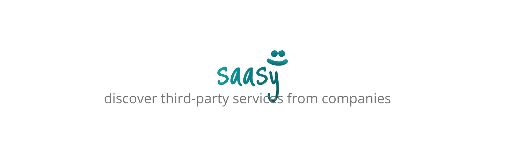
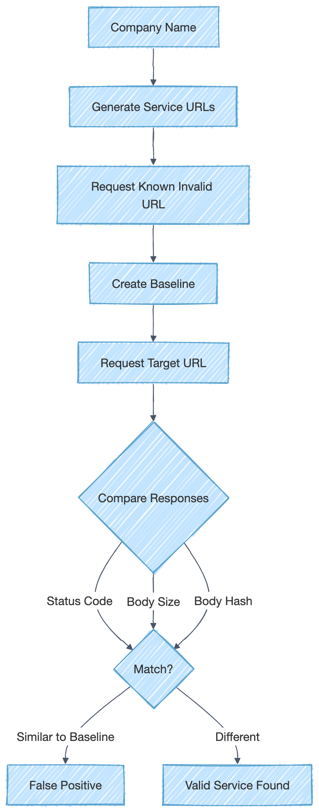

<p align="center">
    <picture>
        
    </picture>
</p>

<hr/>

saasy is a Python tool designed to enumerate third-party services from companies. It uses the targeted company name as the keyword and a placeholder scheme to create a service URL and see if it's a published service. To avoid false positives, it uses a comparison runtime mechanism based on status code, response body size, and response body hash (SHA-256) to generate a baseline and compare it with the actual request, analyzing if there is any similarity between the target service and the already known invalid baseline.

<br>

## Installation
We recommend using [pipx](https://github.com/pypa/pipx) to install the project, so you can run it from anywhere and make things easier.

### Linux
```
sudo apt install pipx git
pipx ensurepath
pipx install git+https://github.com/0xdsm/saasy
```

### MacOS
```
brew install pipx
pipx ensurepath
pipx install git+https://github.com/0xdsm/saasy
```

### Local
```
git clone https://github.com/0xdsm/saasy.git
pipx install .
```

### Updating
```
pipx reinstall saasy
```

<br>

## Usage

To start using saasy, you need to specify a target (keyword). The basic usage is as follows:

Basic usage:
```sh
saasy nubank
saasy 0.1.0 :: discover third-party services from companies

[!] Running... (257 checks)

[+] nubank.netlify.app
[+] nubank.awsapps.com
[+] nubank.vercel.app
[+] nubank.s3.amazonaws.com
[+] nubank.sharepoint.com
[+] nubank.storage.googleapis.com
[+] nubank.surge.sh
[+] nubank.wordpress.com
[+] nubank.onrender.com
[+] nubank.pages.dev
[+] nubank.s3.us-east-1.amazonaws.com

[+] Found 11 valid target(s)
```

You can specify the flag `--verbose` to see the detailed enumeration process. For example:
```
saasy nubank --verbose
saasy 0.1.0 :: discover third-party services from companies

[!] Running... (257 checks)

[*] Capturing netlify baseline
[*] Capturing herokuapp baseline
[*] Capturing awsapps baseline
[*] Capturing vercel baseline
[*] Capturing s3-amazonaws baseline
[*] Capturing elasticbeanstalk baseline
[*] Capturing cloudfront baseline
[*] Capturing execute-api-amazonaws baseline
[*] Capturing azurewebsites baseline
[*] Capturing blob-core-windows baseline
[*] cloudfront baseline failed (no wildcard DNS): [Errno 8] nodename nor servname provided, or not known
[*] cloudfront target failed: [Errno 8] nodename nor servname provided, or not known
[*] Capturing cloudapp baseline
[*] vercel baseline: {'status_code': 404, 'body_size': 107, 'body_hash': '61fe8b4759d9d5c0634d7437b834b193adf9c4b36b9711e1f511bc2dab0bd543'}
[*] netlify baseline: {'status_code': 404, 'body_size': 50, 'body_hash': 'bd8f2dc2b56a9b97f48e304d1e80500dc431caf5a61348e2ba0c3c7810efcea5'}
[*] vercel target: {'status_code': 200, 'body_size': 18359, 'body_hash': '383265fcb674cd8edd43d20ee7d909a1c6a2a4aab2fbfd613a9607146f605d59'}
...
```

Also, you can save the valid findings in a file with the flag `--output <filename>`. For example:
```
saasy nubank --output results.txt
```

<br>

## Flowchart
<picture>
    
</picture>
<br>

## To-Do
- [ ] Improve false-positive detection mechanism
- [ ] Add more third-party services to `services.yaml`
